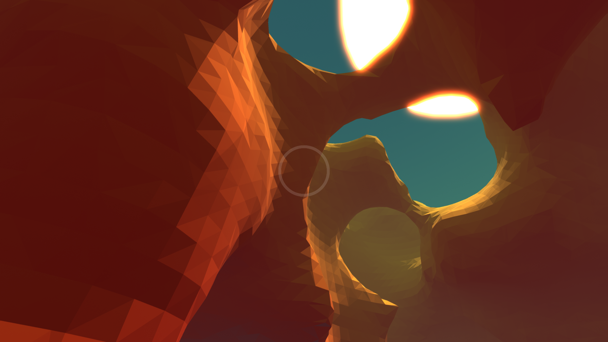
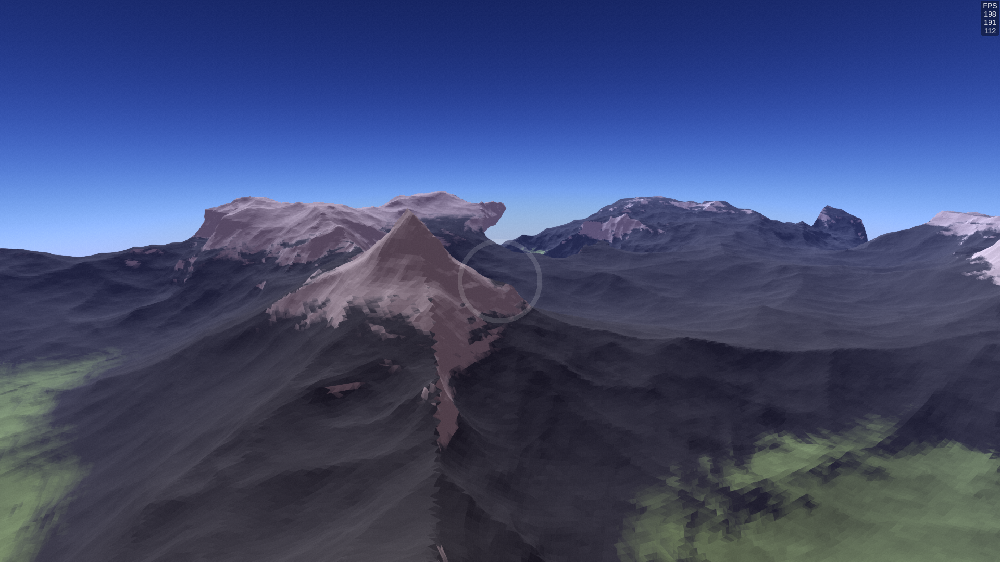
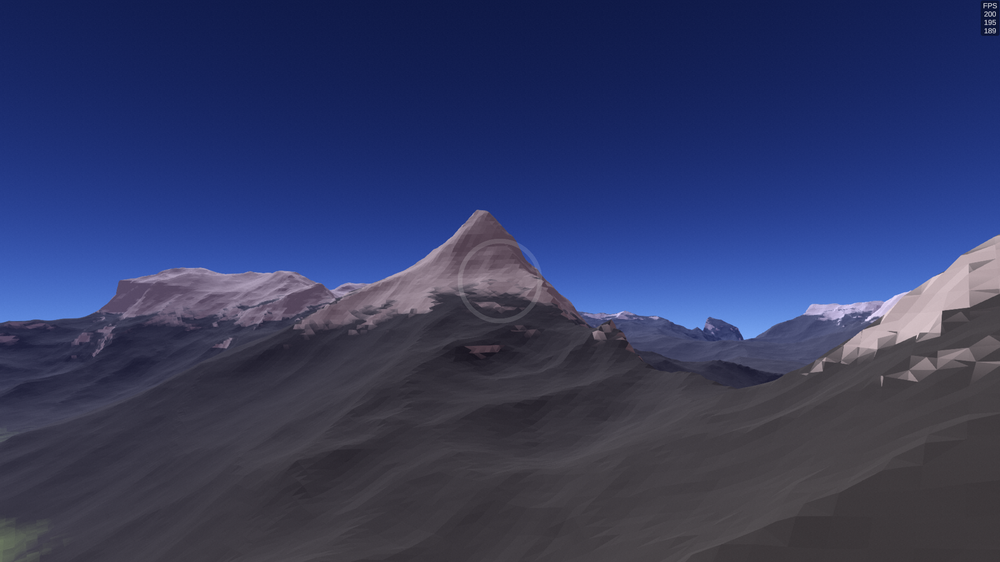
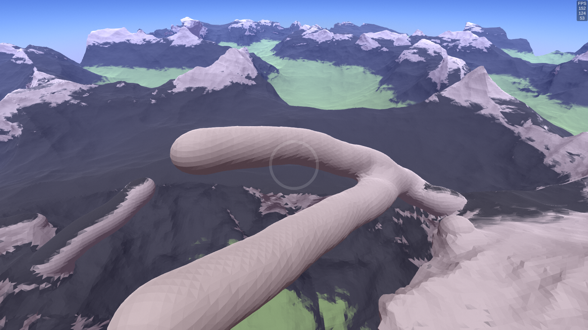
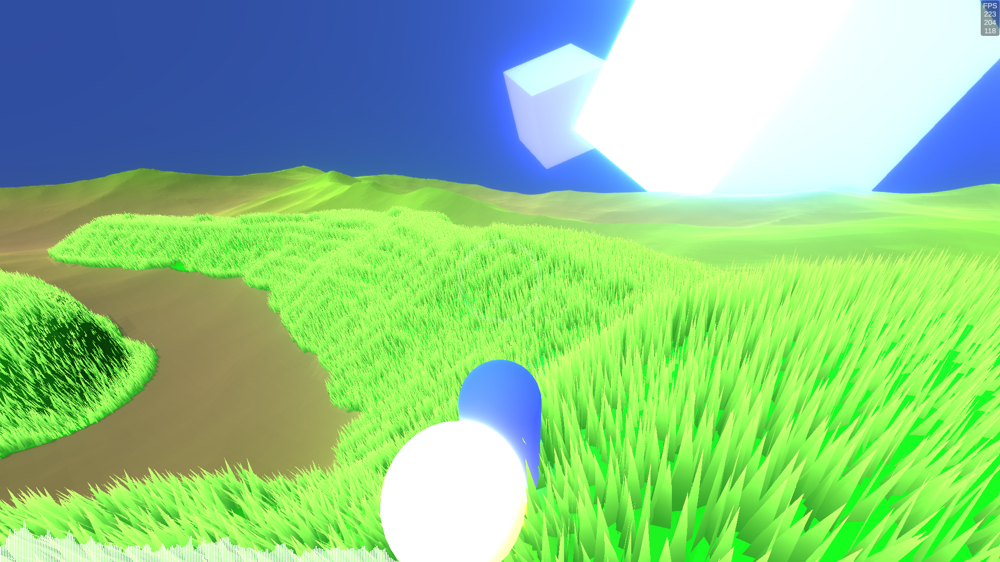
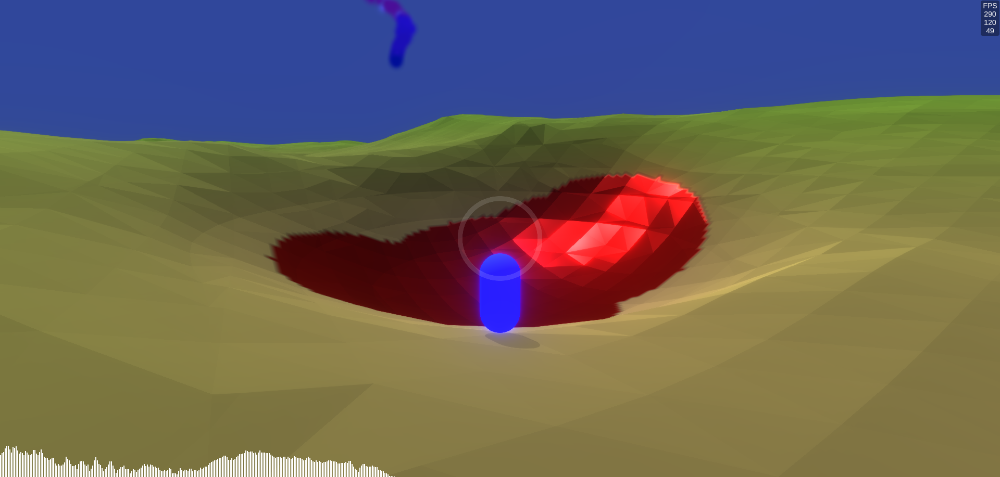
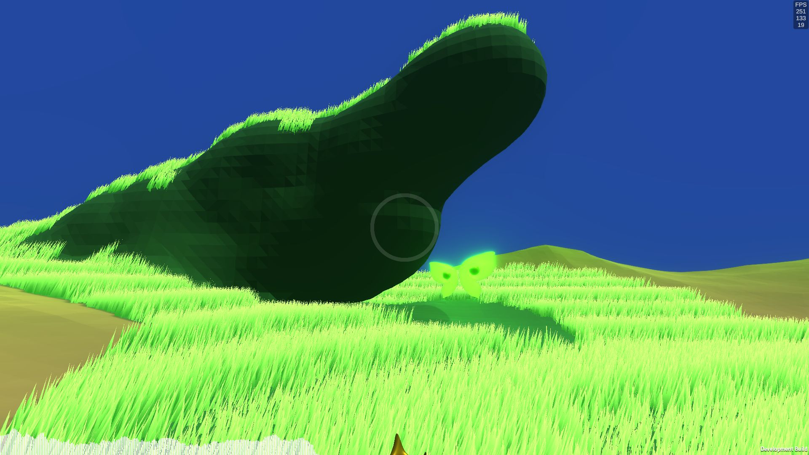
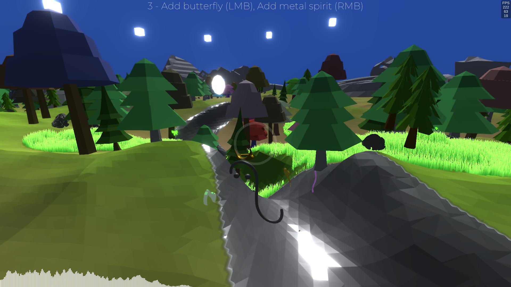

# Virtual World Free Exploration Platform

This is a Unity project that allows you to explore and modify a procedurally generated virtual world. You can create planets and mountains, grow grasslands, and dig or build terrain. You can also join other players online and see their actions.

## Project Setup

To set up this project, you need to have Unity installed on your computer. You can download it from [here](https://unity.com/). This project uses the Scriptable Render Pipeline (SRP) and Compute Shader to achieve high-performance rendering and computation. Due to these features, there is limited support for Mac OS, and no support for Web GL. Please make sure your system meets the [requirements](https://docs.unity3d.com/Manual/ComputeShaders.html) before running this project.

To open this project, simply clone or download this repository and open it in Unity. You can then run the project in the editor or build it as an executable.

## Spotlights

Some of the highlights of this project are:

- Perlin noise generation: The project uses Perlin noise to create realistic and varied terrain shapes and textures. Perlin noise is a type of gradient noise that produces natural-looking patterns. You can learn more about it [here](https://en.wikipedia.org/wiki/Perlin_noise).
- Marching cubes algorithm: The project uses the marching cubes algorithm to convert the noise values into a mesh of triangles. This algorithm creates smooth surfaces from discrete data points. You can learn more about it [here](https://en.wikipedia.org/wiki/Marching_cubes).
- Dynamic map chunk construction: The project divides the world into chunks of fixed size and generates them on demand. This allows for infinite exploration without loading the entire world at once. The chunks are also updated when the terrain is modified by the player.
- Online multiplayer: The project supports simple online multiplayer using Mirror, a high-level networking library for Unity. Mirror handles the low-level networking details and provides easy-to-use components for synchronizing game objects and data. You can learn more about it [here](https://mirror-networking.com/).

## Further Improvements

Some of the possible improvements for this project are:

- Terrain synchronization: Currently, the terrain modifications made by one player are not visible to other players. This can be improved by sending the changes over the network and applying them to the corresponding chunks on each client.
- Biome generation: The project could be enhanced by adding different biomes to the world, such as forests, deserts, oceans, etc. This would create more diversity and interest for the players.
- Lighting and shadows: The project could benefit from adding dynamic lighting and shadows to the world, especially for the planets and mountains. This would create more realistic and immersive effects.
- User interface: The project could use a better user interface to display information and options to the players, such as a minimap, a inventory, a menu, etc. This would make the game more user-friendly and accessible.

## Image Demonstration

Here are some screenshots of the project showing different features and effects.

### Planet Generation and Free Editing

### Mountain Generation

### Music World

